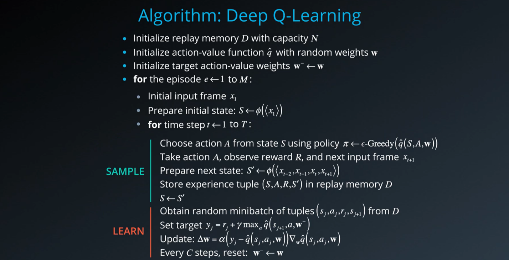

# Project 1: Navigation
Yu Tao

### Overview

In this project, a reinforcement learning (RL) agent was trained to navigate (and collect bananas!) in a large, square world. A reward of +1 is provided for collecting a yellow banana, and a reward of -1 is provided for collecting a blue banana. The goal of the agent is to collect as many yellow bananas as possible while avoiding blue bananas. The task is episodic, and in order to solve the environment, the agent must get an average score of +13 over 100 consecutive episodes.

The environment is similar to the [Unity's Banana Collector environment](https://github.com/Unity-Technologies/ml-agents/blob/master/docs/Learning-Environment-Examples.md#banana-collector). The state space has 37 dimensions and contains the agent's velocity, along with ray-based perception of objects around agent's forward direction. Given this information, the agent has to learn how to best select actions. Four discrete actions are available, corresponding to:
- **`0`** - move forward.
- **`1`** - move backward.
- **`2`** - turn left.
- **`3`** - turn right.

### Learning algorithm

This project implemented a value-based method called [Deep Q-Networks](https://en.wikipedia.org/wiki/Q-learning). A DQN, or Deep Q-Network, represents the action-value function in a Q-Learning framework as a neural network.



Deep RL use non-linear function approximators (deep neural network) to calculate the action values based directly on observation (state) from the environment. RL is notoriously unstable when neural networks are used to represent the action values (weights oscillate and diverge due to the high correlation between actions and states). Deep Q-Learning algorithm addressed these instabilities by using two key features: (1) Experience Replay; (2) Fixed Q-Targets.

For detailed information on DQN, please look at the original [Deep Q-Learning algorithm paper](https://storage.googleapis.com/deepmind-media/dqn/DQNNaturePaper.pdf).

The model architecture is as follows:


I built a DQN with 2 fully-connected (FC) layers with 1024 nodes, each followed by a ReLu activation function. The network used the Adam optimizer, and the learning rate was set to 0.0005, with a batch size of 64. This model solved the environment in 513 episodes.


Deep Q Learning combines 2 approaches :
- A Reinforcement Learning method called [Q Learning](https://en.wikipedia.org/wiki/Q-learning) (aka SARSA max)
- A Deep Neural Network to learn a Q-table approximation (action-values)

Especially, this implementation includes the 2 major training improvements by [Deepmind](https://deepmind.com) and described in their [Nature publication : "Human-level control through deep reinforcement learning (2015)"](https://storage.googleapis.com/deepmind-media/dqn/DQNNaturePaper.pdf)
- Experience Replay 
- Fixed Q Targets

> Reinforcement learning is known to be unstable or even to diverge when a nonlinear function approximator such as a neural network is used to represent the action-value (also known as Q) function20. This instability has several causes: the correlations present in the sequence of observations, the fact that small updates to Q may significantly change the policy and therefore change the data distribution, and the correlations
between the action-values and the target values .
We address these instabilities with a novel variant of Q-learning, which uses two key ideas. First, we used a biologically inspired mechanism termed experience replay that randomizes over the data, thereby removing correlations in the observation sequence and smoothing over changes in the data distribution. Second, we used an iterative update that adjusts the action-values towards target values that are only periodically updated, thereby reducing correlations with the target.

### Algorithm


This algorithm screenshot is taken from the [Deep Reinforcement Learning Nanodegree course](https://www.udacity.com/course/deep-reinforcement-learning-nanodegree--nd893)


### Code implementation

The code used here is derived from the "Lunar Lander" tutorial from the [Deep Reinforcement Learning Nanodegree](https://www.udacity.com/course/deep-reinforcement-learning-nanodegree--nd893), and has been slightly adjusted for being used with the banana environment.

The code consist of :

- model.py : In this python file, a PyTorch QNetwork class is implemented. This is a regular fully connected Deep Neural Network using the [PyTorch Framework](https://pytorch.org/docs/0.4.0/). This network will be trained to predict the action to perform depending on the environment observed states. This Neural Network is used by the DQN agent and is composed of :
  - the input layer which size depends of the state_size parameter passed in the constructor
  - 2 hidden fully connected layers of 1024 cells each
  - the output layer which size depends of the action_size parameter passed in the constructor
- dqn_agent.py : In this python file, a DQN agent and a Replay Buffer memory used by the DQN agent) are defined.
  - The DQN agent class is implemented, as described in the Deep Q-Learning algorithm. It provides several methods :
    - constructor : 
      - Initialize the memory buffer (*Replay Buffer*)
      - Initialize 2 instance of the Neural Network : the *target* network and the *local* network
    - step() : 
      - Allows to store a step taken by the agent (state, action, reward, next_state, done) in the Replay Buffer/Memory
      - Every 4 steps (and if their are enough samples available in the Replay Buffer), update the *target* network weights with the current weight values from the *local* network (That's part of the Fixed Q Targets technique)
    - act() which returns actions for the given state as per current policy (Note : The action selection use an Epsilon-greedy selection so that to balance between *exploration* and *exploitation* for the Q Learning)
    - learn() which update the Neural Network value parameters using given batch of experiences from the Replay Buffer. 
    - soft_update() is called by learn() to softly updates the value from the *target* Neural Network from the *local* network weights (That's part of the Fixed Q Targets technique)
  - The ReplayBuffer class implements a fixed-size buffer to store experience tuples  (state, action, reward, next_state, done) 
    - add() allows to add an experience step to the memory
    - sample() allows to randomly sample a batch of experience steps for the learning       
- DQN_Banana_Navigation.ipynb : This Jupyter notebooks allows to train the agent. More in details it allows to :
  - Import the Necessary Packages 
  - Examine the State and Action Spaces
  - Take Random Actions in the Environment (No display)
  - Train an agent using DQN
  - Plot the scores

### DQN parameters and results

The DQN agent uses the following parameters values (defined in dqn_agent.py)

```
BUFFER_SIZE = int(1e5)  # replay buffer size
BATCH_SIZE = 64         # minibatch size 
GAMMA = 0.995           # discount factor 
TAU = 1e-3              # for soft update of target parameters
LR = 5e-4               # learning rate 
UPDATE_EVERY = 4        # how often to update the network
```

The Neural Networks use the following architecture :

```
Input nodes (37) -> Fully Connected Layer (1024 nodes, Relu activation) -> Fully Connected Layer (1024 nodes, Relu activation) -> Ouput nodes (4)
```

The Neural Networks use the Adam optimizer with a learning rate LR=5e-4 and are trained using a BATCH_SIZE=64

Given the chosen architecture and parameters, our results are :


**These results meets the project's expectation as the agent is able to receive an average reward (over 100 episodes) of at least +13, and in 1023 episodes only** (In comparison, according to Udacity's solution code for the project, their agent was benchmarked to be able to solve the project in fewer than 1800 episodes)

### Ideas for future work

To improve the performance of the agent, there are several ideas to modify the deep Q-Learning algorithm we have used:
-	**Double DQN**: Deep Q-Learning tends to [overestimate](https://www.ri.cmu.edu/pub_files/pub1/thrun_sebastian_1993_1/thrun_sebastian_1993_1.pdf) the action values. Double Q-Learning has been shown to work well in practice to help with [this](https://arxiv.org/abs/1509.06461).
-	**Prioritized Experience Replay**: Deep Q-Learning samples experience transitions uniformly from a replay memory. [Prioritized experienced replay](https://arxiv.org/abs/1511.05952) is based on the idea that the agent can learn more effectively from some transitions than from others, and the more important transitions should be sampled with higher probability.
-	**Dueling DQN**: Currently, in order to determine which states are (or are not) valuable, we have to estimate the corresponding action values for each action. However, by replacing the traditional Deep Q-Network (DQN) architecture with a [dueling architecture](https://arxiv.org/abs/1511.06581), we can assess the value of each state, without having to learn the effect of each action.

Besides, we can also train the agent directly from its observed raw pixels of the environment instead of using the 37 dimensional states. In this case, we can add a series of [Convolutional Neural Networks](https://en.wikipedia.org/wiki/Convolutional_neural_network) to extract the spatial features from the pixels. DeepMind already leveraged such method to build the Deep Q-Learning algorithm that learned to play Atari video games.
